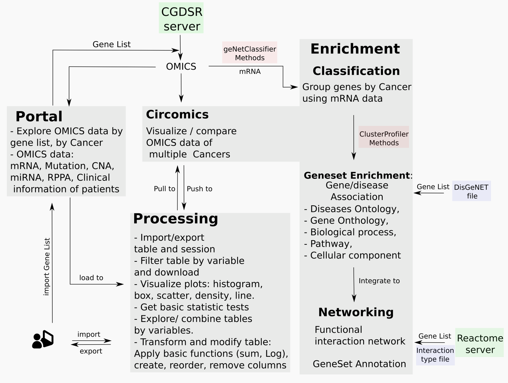

### Overview of Methods used in bioCancer

> Display available Cancer Studies in Table

### Studies Panel

This panel displays in table all available cancer studies hosted and maintained by Memorial Sloan Kettering Cancer Center ([MSKCC](https://www.mskcc.org)). It provides access to data by The Cancer Genome Atlas as well as many carefully curated published data sets. 

Every row lists one study by `Identity`, `name` and `description`.

#### Browse the data

By default only 10 rows of are shown at one time. You can change this setting through the `Show ... entries` dropdown. Press the `Next` and `Previous` buttons at the bottom-right of the screen to navigate through the data.

#### Sort

Click on a column header in the table to sort the data by the values of that variable. Clicking again will toggle between sorting in ascending and descending order. To sort on multiple columns at once press shift and then click on the 2nd, 3rd, etc. column to sort by.

### Filters in Table
The search is possible for numerical or categorical variables. It is possible to match `string` or to use mathematical `operator` to filter data. For more detail see help page in Processing > View panel. 
#### Global Search
the `Filter` box on the left (click the check-box first).
#### Column filter
Every column has its filetr at the column header.

### Download table as csv file
User can download table as csv file. Use the download icon in the top-right of the page.

### Side bar Menu

#### Studies List
The Drop Down Boxes allow user to select one Id by type of data. The first one displays studies by Identity. It means the code listed in the column `cancer_study_id`. The id is simple to decrypte. It is the association of the short name of the cancer followed (\_) by the source of the study.

#### Cases and Genetic Profiles for selected study
When user change the study, automatically the relative cases and genetic profiles are updated.

The ids of cases and genetic profile are composed by cancer\_Source\_TypeOfData.

There are 6 types of data or dimensions: Copy Number Alteration (CNA, gistic), mRNA, Methylation (Met\_HM27, Met\_HM450), Mutation, miRNA, Reverse Phase Protein Activity (RPPA).

#### Gene List Examples

Gene List Example. By default there is one example of gene list (DNA\_damage\_Response). User can load other examples or own gene list in Profiles or Mutation Panels.

