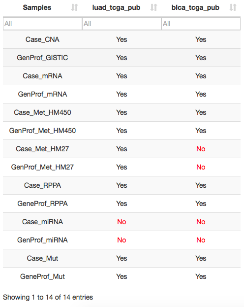
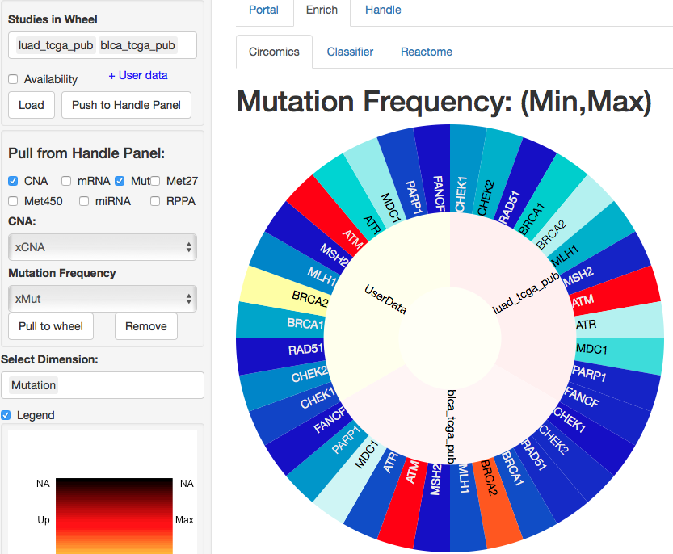

> Show multi-Omics Data in Circular Layout

The world `Circomics` comes from the association between `Circos` and `Omics`.

[Circos](http://circos.ca/) is a package for visualizing data and information with circular layouts. User can visualize multiple matrices of [Omics](https://en.wikipedia.org/wiki/Omics) data at the same time and makes easy the exploring of relationships between dimensions using coloring sectors.

This function uses [CoffeeWheel](https://github.com/armish/coffeewheel) package developped by Dr. Arman Aksoy.

#### Studies in Wheel
User needs to:
* Choice in which Studies is interested.
* Visualize the availability of dimensions by checking `Availability`. 
+ The output is a table with Yes/No availability.
* Load Omics data for selected Studies by checking `Load`. The output is a list of loaded dimensions for selected Studies.

When Profiles Data are loaded, the button `Load Profiles in Datasets` appears. It uploads all Profiles Data to `Handle` panel for more exploring or analysis.

#### Availability 
`Availability` checkbox checks existing genetic profiles for each selected study. Tis function displays result in table.

#### (Push) Load Profiles data in Datasets (to Handle Panel)

For every dimension, the tables are merged by study and saved as: `xCNA`, `xMetHM27`, `xMetHM450`, `xmiRNA`, `xmRNA`, `xMut`, `xRPPA` in Datasets (Handle panel).

#### Pull User Data in circular Layout
Comparing experimental analysis to existing cancer genomics data could be used to predict the risk of cancer disorder using epigenmics profiles. 
User can import its experimental data from `Handle` panel and pull them to circular layout. In the following case, we pulled `xCNA` and `xMut` (User data) dataframes to circular layout with `luad_tcga_pub` and `blca_tcga_pub` studies. 
User can `remove` and `pull` him data for all existing dimension.
`Legend` checkbox displays the meaning of the color palette.

