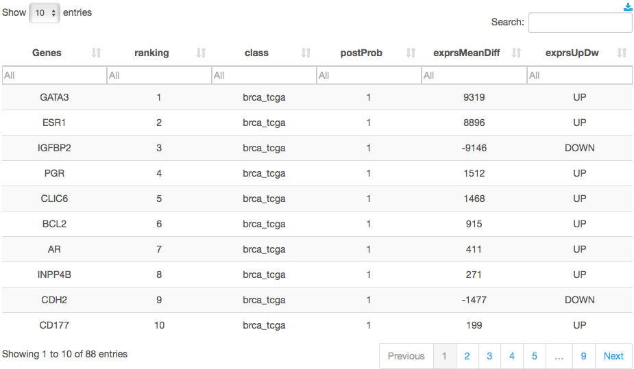
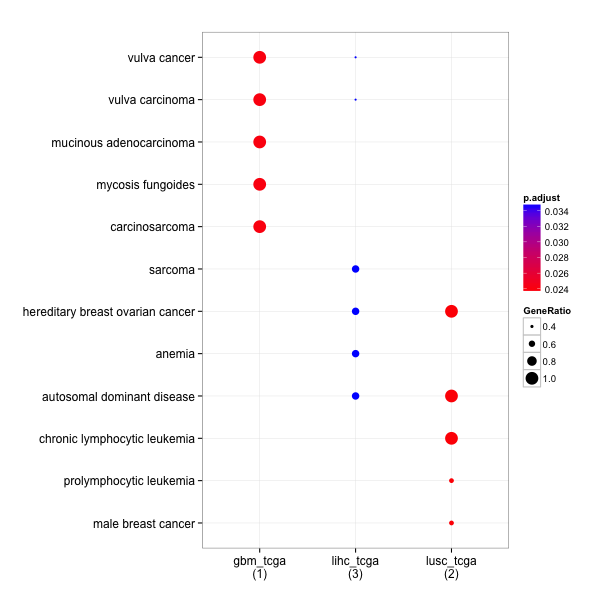

> Genes / Diseases / Pathways Classification and clustering

### Classification
The classifier uses `geNetClassifier` methods [1] to classify genes by disease based only on gene expression (mRNA). The approach is implemented in an R package, named [geNetClassifier](http://bioconductor.org/packages/release/bioc/html/geNetClassifier.html), available as an open access tool in [Bioconductor](http://bioconductor.org/).
All proccess are resumed into 5 steps:
* Select Studies
* get sample size by  `processing` > `Samples` 
* Set the sample size and the posterior probability
* Select one `Case` and one `Genetic Profile` for every study. **Respect the order of studies**. it is recommanded to use `_v2_mrna` for all genetic profiles.
* Run classifier by `processing` > `Classifier`

The ranking is built by ordering the genes decreasingly by their pos- terior probability for each study (class). Each gene is assigned to a class in which has the best ranking. As a result of this process, even if a gene is found associated to several classes during the expression analysis, each gene can only be on the ranking of one class [1]. 
The resulting output is a table (Table 1) that associates genes to study and displays `PostProb` and gene expression sign `exprsUpDw`.  The `exprsMeanDiff` value is the expression difference between the mean for each gene in the given class and the mean in the closest class.

**Table1: Ranking Genes by Study**

### Plot Clusters

#### Gene Diseases Association
`GeneList/Diseases` predicts Wich disease are involving your GeneList. It uses annotations from [DisGeNET](http://www.disgenet.org/web/DisGeNET/menu;jsessionid=1bxru0uf4yelm16ipuhie2qhij) [2] and Methods from [clusterProfiler](http://bioconductor.org/packages/release/bioc/html/clusterProfiler.html) package [3].  

The `GeneList/Diseases` association uses gene list as input. The assess of this prediction is based on two parameters:
* The number of genes that are involving in the disease (x-axis)
* The P-value of this association (color). 
In the following example,  there are two annotation related to Breast cancer which  involve more than 130 genes and has small P-Value.

**Figure 1: Genes / Diseases Association**

The `Diseases Onthology` uses genes/Study groups computed by `Classifier` (Table 1).
The dotplot position indicates wish Diseases are annotated for genes/study [4].
The dot size indicates the ratio of genes involved in the disease for the same genes groups (lihc_tcga has 2/3 genes involved for the 4 disease). The color indicates the P-Value.

**Figure 2: Diseases Onthology**
 

The same process is possible with Gene Onthology (GO) and KEGG.

**Figure 3: GO Pathway Enrishment**
 

**Figure 4: KEGG Pathway Enrishment **
 

#### References
[1] Aibar S, Fontanillo C, Droste C, Roson-Burgo B, Campos-Laborie F, Hernandez-Rivas J and De Las Rivas J (2015). “Analyse multiple disease subtypes and build associated gene networks using genome-wide expression profiles.” BMC Genomics, 16(Suppl 5:S3). http://dx.doi.org/10.1186/1471-2164-16-S5-S3.

[2] Piñero, J., Queralt-Rosinach, N., Bravo, À., Deu-Pons, J., Bauer-Mehren, A., Baron, M., Ferran Sanz, and Furlong, L. I. (2015). DisGeNET: a discovery platform for the dynamical exploration of human diseases and their genes. Database: The Journal of Biological Databases and Curation, 2015, bav028. http://doi.org/10.1093/database/bav028

[3] Yu G, Wang L, Han Y and He Q (2012). “clusterProfiler: an R package for comparing biological themes among gene clusters.” OMICS: A Journal of Integrative Biology, 16(5), pp. 284-287. http://dx.doi.org/10.1089/omi.2011.0118. 

[4] Yu G, Wang L, Yan G and He Q (2015). “DOSE: an R/Bioconductor package for Disease Ontology Semantic and Enrichment analysis.” Bioinformatics, 31(4), pp. 608-609. http://dx.doi.org/10.1093/bioinformatics/btu684, http://bioinformatics.oxfordjournals.org/content/31/4/608. 

