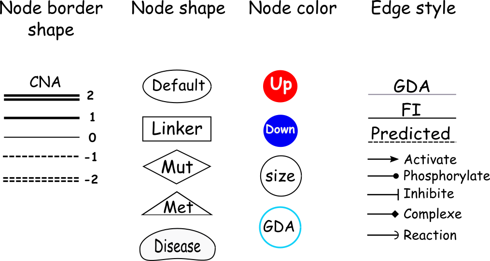
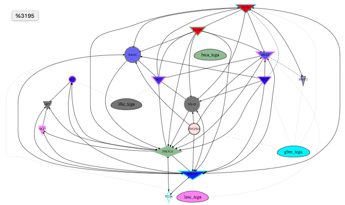

> Function Interaction Network Enrishment

### Edges Attributes

#### Function Interactions (FIs) Type

Arrowhead | Reaction | Arrowhead | Reaction 
------------- | -------- | -------- | ------------
-> | activate, express, regulate  | -\| | inhibit
diamond -<>  | complexe |curve | catalyze, reaction
  point -o| phosphorylate | -- | binding, input, compound
 -< | dissociation | .... | predicted, indirect,ubiquitinated

#### Use Linkers
 Picks up as few as possible of linkers that can connect input genes together. For example, if the algorithm finds one gene can link all input genes together, it will not try other genes (not from gene list) that may be used as a linker.
 
 The linker gene hes box format. 
 
#### Layouts 
 
##### dot
 The dot engine flows the directed graph in the direction of rank (i.e., downstream nodes of the same rank are aligned). By default, the direction is from top to bottom 
##### twopi
 The twopi engine provides radial layouts. Nodes are placed on concentric circles depending their distance from a given root node.
 
##### neato
 The neato engine provides spring model layouts. This is a suitable engine if the graph is not too large (less than 100 nodes) and you don't know anything else about it. The neato engine attempts to minimize a global energy function, which is equivalent to statistical multi-dimensional scaling. 
 
##### circo
The circo engine provide circular layouts. This is suitable for certain diagrams of multiple cyclic structures, such as certain telecommunications networks.

### Nodes Attributes

#### From ReactomeFI
The size of node is related to the number of inetractions. If node has multiple interaction, it will has bigger size than node with few interaction. Otherwise, i will be easier to locate important gene in the network. 

#### From Classifier

##### mRNA
Attribute node color using `exprsMeanDiff` values from `Classifier` panel.

##### Studies
Link study to associated genes from `Classifier` table.

#### From Profiles Data

User needs to
* Select studies (`From Which Studies`)
* Load profiles data (`Load`). 
* Select Profiles Data
* Set threshold from Sliders 

#### Legend

### Interpretation

