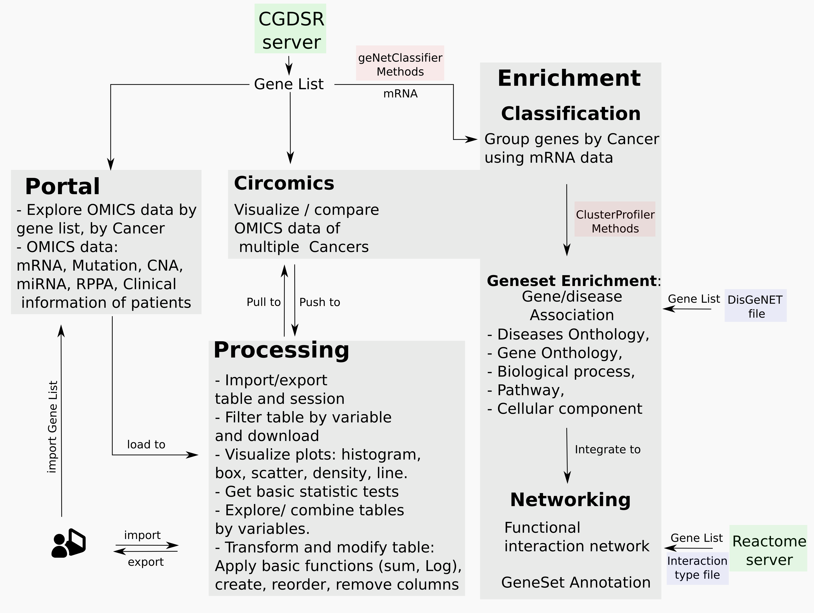
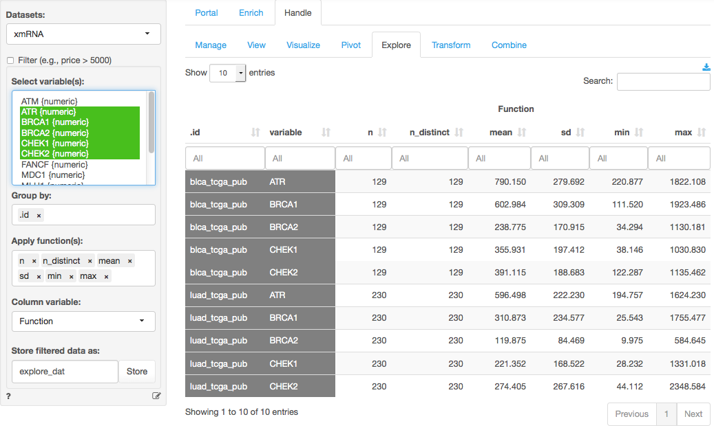

```{r style, echo=FALSE, results="asis", message=FALSE}
knitr::opts_chunk$set(tidy = FALSE,
                      warning = FALSE,
                      message = FALSE)
```


# bioCancer Package 

bioCancer is a platform-independent interface for dynamic interaction with cancer genomics data. The web is implemented in the R language and based on the Shiny package. It runs on any modern Web browser and requires no programming skills, increasing the accessibility to the huge, complex and heterogeneous cancer genomic data. The data are provided from cBioPortal that contains data from 105 cancer genomics studies. The studies are updated monthly, based on the last TCGA production runs. User can access easily to studies, search in clinical data or by genetic profiles. All data are displayed in table which user can filter, combine, download, visualize and get statistics on it. For more global exploring, zoomable circular layout are available to merge and view around twenty matrices in the same plot. The circular layout makes easy and rapid to identify pertinent multi-assays changes in genes through multiple cancers or studies.
The web page implements multiple methods, to classify genes by study or by disease, to cluster studies by biological process or other ontology annotation. From gene list user can predicts functional interaction network. Nodes and edges can be colored and formatted by omics cancer data. User is free to choose which dimension will be included in network and can set some thresholds to view only significant biological scenario.
The web accepts multiple format of input data that can be included by user to compare/analysis with/without cancer studies. All investigation done by user can be saved in session and can be reloaded later or shared with colleagues. The main R plotting features are available and easy to use. User needs only to chose the type of plot and select variables to be viewed. All generated plot is downloadable with a high resolution.
 bioCancer has dynamic sidebar dashboard that changes and displays functionalities depending on user request. It reduces excessive clicking or false queries. It can be launched in local machine with any system with R installed or used from a remote server as in ([bioCancer Server ](http://46.101.227.144:3838/bioCancer/)). All navigating panel are well assisted and documented by examples.
bioCancer is free and open to all users and there is no login requirement.

## Pipeline Overview



## How to run bioCancer
```
library(bioCancer)
bioCancer()
```
# Portal Panel

## Display available Cancer Studies in Table

### Studies Panel

This panel displays in table all available cancer studies hosted and maintained by Memorial Sloan Kettering Cancer Center ([MSKCC](https://www.mskcc.org)). It provides access to data by The Cancer Genome Atlas as well as many carefully curated published data sets. 

Every row lists one study by `Identity`, `name` and `description`.

#### Browse the data

By default only 10 rows of are shown at one time. You can change this setting through the `Show ... entries` dropdown. Press the `Next` and `Previous` buttons at the bottom-right of the screen to navigate through the data.

#### Sort

Click on a column header in the table to sort the data by the values of that variable. Clicking again will toggle between sorting in ascending and descending order. To sort on multiple columns at once press shift and then click on the 2nd, 3rd, etc. column to sort by.

### Filters in Table
The search is possible for numerical or categorical variables. It is possible to match `string` or to use mathematical `operator` to filter data. For more detail see help page in Processing > View panel. 
#### Global Search
the `Filter` box on the left (click the check-box first).
#### Column filter
Every column has its filetr at the column header.

### Download table as csv file
User can download table as csv file. Use the download icon in the top-right of the page.

### Side bar Menu

#### Studies List
The Drop Down Boxes allow user to select one Id by type of data. The first one displays studies by Identity. It means the code listed in the column `cancer_study_id`. The id is simple to decrypte. It is the association of the short name of the cancer followed (\_) by the source of the study.


#### Cases and Genetic Profiles for selected study
When user change the study, automatically the relative cases and genetic profiles are updated.

The ids of cases and genetic profile are composed by cancer\_Source\_TypeOfData.

There are 6 types of data or dimensions: Copy Number Alteration (CNA, gistic), mRNA, Methylation (Met\_HM27, Met\_HM450), Mutation, miRNA, Reverse Phase Protein Activity (RPPA).

#### Gene List Examples

Gene List Example. By default there is one example of gene list (DNA\_damage\_Response). User can load other examples or own gene list in Profiles or Mutation Panels.

## Show Clinical Data in Table

Clinical panel displays informations related to patients as `AGE`, `GENDER` and other variables depending on study and type of cancer. Some variables are shared between studies and others are specific. Each row corresponds to one patient.

### Side bar menu

The Clinical Data is specifuic to each Study. When user change the select Study, the Table of the Clincal Data is automatically updated. The panel is aloso listening DropDown box of Cases.

#### Select variables to show

By default all columns in the data are shown. Click on any variable to focus on it alone. To select several variables use the SHIFT and ARROW keys on your keyboard. On a mac the CMD key can also be used to select multiple variables. The same effect is achieved on windows using the CTRL key. To select all variable use CTRL-A (or CMD-A on mac).

#### Load Clinical Data to Datasets (to Processing Panel)

It is interesting to use clinical variables for further analysis using Processing panel tools.

The `Load ClinicalData` loads the clincal data table to `Datasets` in `Processing` panel. Otherwise, user can make all manipulation tools available in `Processing` panel or in Main Menu Page.

With `clipboard` option, user can copy and paste own table from external file (txt, xls, odt).

## Show Profiles Data in Table

Profiles panel displays informations related to gene list. User needs to specify a `Study`, a `Case`, and a `Genetic Profile` to get the right profile. 

It is more practice to select that have all data (case`_all`) and change only the profile. 

There are in general but not always, 6 types of genetic profiles:
* Copy Number Alteration ([CNA](https://en.wikipedia.org/wiki/Copy-number_variation)).
* mRNA expression ([mRNA](https://en.wikipedia.org/wiki/Gene_expression))
* Mutations ([Mut](https://en.wikipedia.org/wiki/Mutation))
* Methylation ([Met](https://en.wikipedia.org/wiki/DNA_methylation)): There are two probes `HM_27` and `HM_450`
* microRNA expression ([miRNA](https://en.wikipedia.org/wiki/MicroRNA))
* Reverse Phase Protein Array ([RPPA](https://en.wikipedia.org/wiki/Reverse_phase_protein_lysate_microarray))

It is possible to find other kind of data related to one of listed types. For example the `log` or [z_score](http://www.cbioportal.org/faq.jsp#what-are-mrna-and-microrna-z-scores) of mRNA expression.

#### Load Gene List
User can upload gene list examples or upload own gene list.

When user selects `examples` and clic on `Load examples` button, the gene list examples is loaded in DropDown Gene List.

When User selects  `clipboard`, it is possible to copy own gene list from text file (gene symbol by line) and clic on  `Paste Gene List` button. The gene List will be named  `Genes` in DropDown Gene List.

#### Load Profiles to Datasets

It is interesting to get any statistics analysis or transformation with genetic profiles. Any table from `Profiles` panel can be loaded to `Processing` panel by checking `Load Profiles to Datasets` and press the button. The data frame will be named `ProfData`.
# Processing Panel

## Manage data and state: Load data into bioCancer, Save data to disk, Remove a dataset from memory, or Save/Load the full state of the app


### Datasets

When you start bioCancer a dataset (`epiGenomics`) with information on how it was formatted is shown in `Processing` panel.

It is good practice to add a description of the data and variables to each file you use. For the files that are part of bioCancer you will see a brief overview of the variables etc. below the table of the first 10 rows of the data. If you would like to add a description for your own data check the 'Add/edit data description' check-box. A window will open below the data table where you can add text in
<a href="http://rmarkdown.rstudio.com/authoring_pandoc_markdown.html" target="_blank">markdown</a> format. The descriptions of the data included with bioCancer should serve as a good starting point.

If you would like to rename a dataset loaded in bioCancer check the `Rename data` box, enter a new name for the data, and click the `Rename` button

### Load data

The best way to load and save data for use in bioCancer (and R) is to use the R-data format (rda). These are binary files that can be stored compactly and read into R quickly. Choose `rda` from the `Load data of type` dropdown and click `Choose Files` to locate the file(s) you want to load. If the `rda` file is available online choose `rda (url)` from the dropdown, paste the url into the text input, and press `Load`.

You can get data from a spreadsheet (e.g., Excel or Google sheets) into bioCancer in two ways. First, you can save data from the spreadsheet in csv format and then, in bioCancer, choose `csv` from the `Load data of type` dropdown. Most likely you will have a header row in the csv file with variable names. If the data are not comma separated you can choose semicolon or tab separated. To load a csv file click 'Choose files' and locate the file on your computer. If the `csv` data is available online choose `csv (url)` from the dropdown, paste the url into the text input shown, and press `Load`.

> **Note:** For Windows users with data that contain multibyte characters please make sure your data are in ANSI format so bioCancer can load the characters correctly.

Alternatively, you can select and copy the data in the spreadsheet using CTRL-C (or CMD-C on mac), go to bioCancer, choose `clipboard` from the dropdown, and click the `Paste data` button. This is a short-cut that can be convenient for smaller datasets that are cleanly formatted. If you see a message in bioCancer that the data were not transferred cleanly try saving the data in csv format and loading it into bioCancer as described above.

To access all data files bundled with bioCancer choose `examples` from the `Load data of type` dropdown and click `Load examples`. These files are used to illustrate the various analysis tools accessible in bioCancer. For example, the catalog sales data is used as an example in the help file for regression (i.e., Regression > Linear (OLS)).

### Save data

As mentioned above, the most convenient way to get data in and out of bioCancer is to use the R-data format (rda). Choose `rda` from the `Save data` dropdown and click the `Save data` button to save selected dataset to file.

It is good practice to add a description of the data and variables to each file you use. For the files that are part of bioCancer you will see a brief overview of the variables etc. below the table of the first 10 rows of the data. If you would like to add a description for your own data check the 'Add/edit data description' check-box. A window will open below that data table where you can add text in
<a href="http://rmarkdown.rstudio.com/authoring_pandoc_markdown.html" target="_blank">markdown</a> format. The descriptions of the data included with bioCancer should serve as a good starting point. When you save the data as an rda file the description you created (or edited) will automatically be added to the file.

Getting data from bioCancer into a spreadsheet can be achieved in two ways. First, you can save data in csv format and load the file into the spreadsheet (i.e., choose `csv` from the `Save data` dropdown and click the `Save data` button). Alternatively, you can copy the data from bioCancer into the clipboard by choosing `clipboard` from the dropdown and clicking the `Copy data` button, open the spreadsheet, and paste the data from bioCancer using CTRL-V (or CMD-V on mac).

### Save and load state

You can save and load the state of the bioCancer app just as you would a data file. The state file (extension rda) will contain (1) the data loaded in bioCancer, (2) settings for the analyses you were working on, (3) and any reports or code from the R-menu. Save the state-file to your hard-disk and when you are ready to continue simply load it by selecting the state radio button and clicking the `Choose file` button.

The best way to save your analyses is to save the state of the app to a file by clicking on the <i title='Save' class='fa fa-save'></i> icon in the navbar and then on `Save state`. Similar functionality is available in `Data > Manage` tab.

This is convenient if you want to save your work to be completed at another time, perhaps on another computer, or to review any assignments you completed using bioCancer. You can also share the file with others that would like to replicate your analyses. As an example, download and then load the state_file [`RadiantState.rda`](https://vnijs.github.io/radiant/examples/RadiantState.rda). Go to `Data > View`, `Data > Visualize` to see some of the settings loaded from the statefile. There is also a report in `R > Report` created using the Radiant interface. The html file <a href="https://vnijs.github.io/radiant/examples/RadiantState.html" target="_blank">`RadiantState.html`</a> contains the output.

A related feature in bioCancer is that state is maintained if you accidentally navigate to another page, close (and reopen) the browser, and/or hit refresh. Use `Reset` in the <i title='Power off' class='fa fa-power-off'></i> menu in the navigation bar to return to a clean/new state.

Loading and saving state also works with Rstudio. If you start bioCancer from Rstudio and use <i title='Power off' class='fa fa-power-off'></i> > `Stop` to stop the app, lists called `r_data` and `r_state` will be put into Rstudio's global workspace. If you start bioCancer again using `bioCancer()` it will use these lists to restore state. This can be convenient if you want to make changes to a data file in Rstudio and load it back into bioCancer. Also, if you load a state file directly into Rstudio it will be used when you start bioCancer to recreate a previous state.

### Remove data from memory

If data are loaded that you no longer need access to in the current session check the `Remove data from memory` box. Then select the data to remove and click the `Remove data` button. One datafile will always remain open.

### Using commands to load and save data

The `loadr` command can be used to load data from a file directly into a bioCancer session and add it to the `Datasets` dropdown. The `saver` command can be used to exact data from bioCancer and save it to disk. Data can be loaded or saved as `rda` or `rds` format depending on the file extension chosen. These commands can be used both inside or without the bioCancer browser interface. See `?loadr` and `?saver` for details.


## Show data in table form

### Datasets

Choose one of the datasets from the `Datasets` dropdown. Files are loaded into bioCancer through the Manage tab.

### Select columns

By default all columns in the data are shown. Click on any variable to focus on it alone. To select several variables use the SHIFT and ARROW keys on your keyboard. On a mac the CMD key can also be used to select multiple variables. The same effect is achieved on windows using the CTRL key. To select all variable use CTRL-A (or CMD-A on mac).

### Browse the data

By default only 10 rows of are shown at one time. You can change this setting through the `Show ... entries` dropdown. Press the `Next` and `Previous` buttons at the bottom-right of the screen to navigate through the data.

### Sort

Click on a column header in the table to sort the data by the values of that variable. Clicking again will toggle between sorting in ascending and descending order. To sort on multiple columns at once press shift and then click on the 2nd, 3rd, etc. column to sort by.

### Filter

There are several ways to select a subset of the data to view. The `Filter` box on the left (click the check-box first) can be used with `>` and `<` signs and you can also combine subset commands. For example, `x > 3 & y == 2` would show only those rows for which the variable `x` has values larger than 3 **and** for which `y` has values equal to 2. Note that in R, and most other programming languages, `=` is used to _assign_ a value and `==` to evaluate if the value of a variable is equal to some other value. In contrast `!=` is used to determine if a variable is _unequal_ to some value. You can also use expressions that have an **or** condition. For example, to select rows where `mutation frequency` is smaller than 20 and larger than 10 use `FreqMut > 10 & FreqMut < 20`. `&` is the symbol for **and**. The table below gives an overview of common operators.


You can also use string matching to select rows. For example, type `grepl("lu", Diseases)` to select rows with `lung` Cancers. This search is case sensitive by default. For case insensitive search you would use `grepl("TCGA", name, ignore.case = TRUE)`. Type your statement in the `Filter`  box and press return to see the result on screen or an error below the box if the expression is invalid.

It is important to note that these filters are _persistent_. A filter entered in one of the Data-tabs will also be applied to other tabs and to any analysis conducted through the bioCancer menus. To deactivate a  filter uncheck the `Filter` check-box. To remove a filter simply erase it.

<table class='table table-condensed table-hover' style='width:60%;'>
 <thead>
  <tr>
   <th style="text-align:left;"> Operator </th>
   <th style="text-align:left;"> Description </th>
   <th style="text-align:left;"> Example </th>
  </tr>
 </thead>
<tbody>
  <tr>
   <td style="text-align:left;"> `<` </td>
   <td style="text-align:left;"> less than </td>
   <td style="text-align:left;"> `price < 5000` </td>
  </tr>
  <tr>
   <td style="text-align:left;"> `<=` </td>
   <td style="text-align:left;"> less than or equal to </td>
   <td style="text-align:left;"> `carat <= 2` </td>
  </tr>
  <tr>
   <td style="text-align:left;"> `>` </td>
   <td style="text-align:left;"> greater than </td>
   <td style="text-align:left;"> `price > 1000` </td>
  </tr>
  <tr>
   <td style="text-align:left;"> `>=` </td>
   <td style="text-align:left;"> greater than or equal to </td>
   <td style="text-align:left;"> `carat >= 2` </td>
  </tr>
  <tr>
   <td style="text-align:left;"> `==` </td>
   <td style="text-align:left;"> exactly equal to </td>
   <td style="text-align:left;"> `cut == 'Fair'` </td>
  </tr>
  <tr>
   <td style="text-align:left;"> `!=` </td>
   <td style="text-align:left;"> not equal to </td>
   <td style="text-align:left;"> `cut != 'Fair'` </td>
  </tr>
  <tr>
   <td style="text-align:left;"> `|` </td>
   <td style="text-align:left;"> x OR y </td>
   <td style="text-align:left;"> `price > 10000 | cut == 'Premium'` </td>
  </tr>
  <tr>
   <td style="text-align:left;"> `&` </td>
   <td style="text-align:left;"> x AND y </td>
   <td style="text-align:left;"> `carat < 2 & cut == 'Fair'` </td>
  </tr>
  <tr>
   <td style="text-align:left;"> `%in%` </td>
   <td style="text-align:left;"> x is one of y </td>
   <td style="text-align:left;"> `cut %in% c('Fair', 'Good')` </td>
  </tr>
</tbody>
</table>

### Column filters and Search

For variables that have a limited number of different values (i.e., a factor) you can select the levels to keep from the column filter below the variable name. For example, to filter on rows with `CNA = -1`  click in the box below the `CNA` column header and select `-1` from the dropdown menu shown. You can also type a string into these column filters followed by return. Note that matching is case-insensitive. In fact, typing `1` would produce the same result because the search will match any part of a string. Similarly, you can type a string to select observations for character variables (e.g., street names).

For numeric variables the column filter boxes have some special features that make them almost as powerful as the `Filter` box. For numerical and integer variables you can use `...` to indicate a range. For example, to select `mRNA` values between 200 and 500  type `200 ... 500` and press return. The range is inclusive of the values typed. Furthermore, if we want to filter on `FreqMut` `20 ...` will show only Studies with mutation frequancy larger than or equal to 20. Numeric variables also have a slider that you can use to define the range of values to keep.

If you want to get _really_ fancy you can use the search box on the top right to search across all columns in the data using **regular expressions**. For example, to find all rows that have an entry in _any_ column ending with the number 72 type `72$` (i.e., the `$` sign is used to indicate the end of an entry). For all rows with entries that start with 60 use `^60` (i.e., the `^` is used to indicate the first character in an entry). Regular expressions are incredibly powerful for search but this is a _big_ topic area. To learn more about regular expressions see this <a href="http://www.regular-expressions.info/tutorial.html" target="_blank">tutorial</a>.

It is important to note that column sorting, column filters, and search are **not** persistent. To store these settings for use in other parts of bioCancer press the `Store` button. You can store the data and settings under a different dataset name by changing the value in the text input to the left of the `Store` button. This feature can also be used to select a subset of variables to keep. Just select the ones you want to keep and press the `Store` button. For more control over the variables you want to keep or remove and to specify their order in the dataset use the `Data > Transform` tab.


## Visualize data

### Filter

Use the `Filter` box to select (or omit) specific sets of rows from the data. See the helpfile for Data > View for details.

### Plot-type

Select the plot type you want. Choose histograms or density for one or more single variable plots. For example, with the `epiGenomics` data loaded select `Histogram` and all (X) variables (use CTRL-a or CMD-a). This will create histograms for all variables in your dataset. Scatter plots are used to visualize the relationship between two variables. Select one or more variables to plot on the Y-axis and one or more variables to plot on the X-axis. Line plots are similar to scatter plots but they connect-the-dots and are particularly useful for time-series data. Bar plots are used to show the relationship between a categorical variable (X-axis) and the average value of a numeric variable (Y-axis). Box-plots are also used when you have a numeric Y-variable and a categorical X-variable. They are more informative than bar charts but also require a bit more effort to evaluate.

### Box plots

The upper and lower "hinges" of the box correspond to the first and third quartiles (the 25th and 75th percentiles) in the data. The middle hinge is the median value of the data. The upper whisker extends from the upper hinge (i.e., the top of the box) to the highest value in the data that is within 1.5 x IQR of the upper hinge. IQR is the inter-quartile range, or distance, between the first and third quartiles. The lower whisker extends from the lower hinge to the lowest value in the data within 1.5 x IQR of the lower hinge. Data beyond the end of the whiskers could be outliers and are plotted as points (as suggested by Tukey).

In sum:
1. The upper whisker extends from Q3 to min(max(data), Q3 + 1.5 x IQR)
2. The lower whisker extends from Q1 to max(min(data), Q1 - 1.5 x IQR)

You may have to read the two bullets above a few times before it sinks in. The plot below should help to explain the structure of the box plot.


[Source](http://en.wikipedia.org/wiki/File:Boxplot_vs_PDF.svg)

### Sub-plots and heat-maps

`Facet row` and `Facet column` can be used to split the data into different groups and create separate plots for each group.

If you select a scatter or line plot a `Color` drop-down will be shown. Selecting a `Color` variable will create a type of heat-map where the colors are linked to the values of the `Color` variable. Selecting a categorical variable from the `Color` dropdown for a line plot will split the data into groups and will show a line of a different color for each group.

### Line, loess, and jitter

To add a linear or non-linear regression line to a scatter plot check the Line and/or Loess boxes. If your data take on a limited number of values checking Jitter can be useful to get a better feel for where most of the data points are located. Jitter-ing simply adds a small random value to each data point so they do not overlap completely in the plot(s).

### Axis scale

The relationship between variables depicted in a scatter plot may be non-linear. There are numerous transformations we might apply to the data so this relationship becomes (approximately) linear (see Data > Transform) and easier to estimate. Perhaps the most common data transformation applied to business data is the (natural) log. To see if a log-linear or log-log transformation may be appropriate for your data check the `Log X` and/or `Log Y` boxes.

By default the scale of the y-axis is the same across sub-plots when using `Facet row`. To allow the y-axis to be specific to each sub-plot click the `Scale-y` check-box.

### Flip axes

To switch the variable on the X- and Y-axis check the `Flip` box.

### Plot height and width

To make plots bigger or smaller adjust the values in the height and width boxes on the bottom left.

### Customizing plots in R > Report

To customize a plot first generate the visualize command by clicking the report (book) icon on the bottom left of your screen. The example below illustrates how to customize a command in the `R > Report` tab. Notice that `custom` is set to `TRUE`.

```r
visualize(dataset = "diamonds", yvar = "price", xvar = "carat", type = "scatter", custom = TRUE) +
  ggtitle("A scatterplot") + xlab("price in $")
```

See the ggplot2 documentation page for available options <a href="http://docs.ggplot2.org/" target="_blank">http://docs.ggplot2.org</a>.

## Create pivot tables to explore your data

If you have used pivot-tables in Excel the functionality provided in the Pivot tab should be familiar to you. Similar to the Explore tab, you can generate summary statistics for variables in your data. You can also easily generate frequency tables. Perhaps the most powerful feature in Pivot is that you can describe the data _by_ one or more other variables.

For example, with the `epiGenomics` data select `Genes`, `Diseases` and `CNA`  from the Categorical variables drop-down. You can drag-and-drop the selected variables to change their order. The categories for the first variable will be the column headers. After selecting these three variables a frequency table of  data with different Diseases and Genes. Choose `Row`, `Column`, or `Total` from the Normalize drop-down to normalize the frequencies by row, column, or overall total. If a normalize option is selected it can be convenient to check the `Percentage` box to express the numbers as percentages. Choose `Color bar` or `Heat map` from the Conditional formatting drop-down to emphasize the highest frequency counts.

It is also possible to summarize numerical variables. Select `FreqMut` from the Numerical variables drop-down. This will create the table shown below. Just as in the View tab you can sort the table by clicking on the column headers. You can also use sliders (e.g., click in the input box below `I1`) to limit the view to values in a specified range. To view only information for `CNA` with `0` or `-1` levels click in the input box below the `CNA` header.


You can also create a bar chart based on the generated table (see image above). To download the table to _csv_ format or the plot to a _png_ format click the download icon on the right.

### Filter

Use the `Filter` box to select (or omit) specific sets of rows from the data. See the help file for Data > View for details.

## Summarize and explore your data

Generate summary statistics for one or more variables in your data. The most powerful feature in Explore is that you can easy describe the data _by_ one or more other variables. Where the _Pivot_ tab works best for frequency tables and to summarize a single numerical variable, the _Explore_ tab allows you to summarize multiple variables at the same time using various statistics.

For example, if we select `Genes` from the `xmRNA` dataset we can see the number of observations (n), the mean, the median, etc. etc.

The created summary table can be stored in bioCancer by clicking the `Store` button. This can be useful if you want to create plots using the summarized data. To download the table to _csv_ format click the download icon on the top-right.

You can select options from `Column variable` dropdown to switch between different column headers. Select either the `functions` (e.g., mean, median, etc), the variables (e.g., Genes), or the levels of the (first) `Group by` variable (e.g., Studies).



### Filter

Use the `Filter` box to select (or omit) specific sets of rows from the data. See the helpfile for Data > View for details.

### Transform command log

All transformations applied in the _Data > Transform_ tab can be _logged_. If, for example, you apply a `log` transformation to numeric variables the following code is generated and put in the _Transform command log_ window at the bottom of your screen when you click the `Store` button.

<pre>
## transform variable
r_data[["epiGenomics"]] <- mutate_each(r_data[["epiGenomics"]], funs(log), ext = "_log", mRNA, Met450)
</pre>

This is an important feature if you need to recreate your results at some point in the future or you want to re-run a report with new, but similar, data. Even more important is that there is a record of the steps taken to generate all results.

To add commands contained in the command log window to a report in _R > Report_ click the <i title='Report results' class='fa fa-edit'></i> icon.

### Filter

Filter functionality must be turned off when transforming variables. If a filter is active the transform functions will show a warning message. Either remove the filter statement or un-check the `Filter` check-box. Alternatively, navigate to the Data > View tab and click the `Store` button to store the filtered data and select the newly create dataset. Then return to the Transform tab to make the desired variable changes.

### Type

When you select `Type` from the `Transformation type` drop-down another drop-down menu is shown that will allow you to change the type (or class) of one or more variables. For example, you can change a variable of type integer to a variable of type factor. Click the `Store` button to change variable(s) in the data set. A description of the transformations included in bioCancer is provided below.

1. As factor: convert a variable to type factor (i.e., a categorical variable)
2. As number: convert a variable to type numeric
3. As integer: convert a variable to type integer
4. As character: convert a variable to type character (i.e., strings)
5. As date (mdy): convert a variable to a date if the dates are ordered as month-day-year
6. As date (dmy): convert a variable to a date if the dates are ordered as day-month-year
7. As date (ymd): convert a variable to a date if the dates are ordered as year-month-day
8. As date/time (mdy_hms): convert a variable to a date if the dates are ordered as month-day-year-hour-minute-second
9. As date/time (mdy_hm): convert a variable to a date if the dates are ordered as month-day-year-hour-minute
10. As date/time (dmy\_hms): See mdy\_hms
11. As date/time (dmy\_hm): See mdy\_hm
12. As date/time (ymd\_hms): See mdy\_hms
13. As date/time (ymd\_hm): See mdy\_hm

<!--
14. As time (hms): convert variable to class `period` if the time is organized as hour-minute-second
15. As time (hm): convert variable to class `period` if the time is organized as hour-minute
-->

### Transform

When you select `Transform` from the `Transformation type` drop-down another drop-down menu is shown that will allow you to apply common transformations to one or more variables in the data. For example, to take the (natural) log of a variable select the variable(s) you want to transform and choose `Log` from the `Apply function` drop-down. A new variable is created with the extension specified in the 'Variable name extension` text input (e.g,. `_log`). Make sure to press `return` after changing the extension. Click the `Store` button to add the variable(s) to the data set. A description of the transformation functions included in bioCancer is provided below.

1. Log: create a natural log-transformed version of the selected variable (i.e., log(x) or ln(x))
2. Square: multiply a variable by itself (i.e., x^2 or square(x))
3. Square-root: take the square-root of a variable (i.e., x^.5)
4. Absolute: Absolute value of a variable (i.e., abs(x))
5. Center: create a new variable with a mean of zero (i.e., x - mean(x))
6. Standardize: create a new variable with a mean of zero and standard deviation of one (i.e., (x - mean(x))/sd(x))
7. Invert: 1/x
8. Median split: create a new factor with two levels (Above and Below) that splits the variable values at the median
9. Deciles: create a new factor with 10 levels (deciles) that splits the variable values at the 10th, 20th, ..., 90th percentiles.


### Create

Choose `Create` from the `Transformation type` drop-down. This is the most flexible command to create new or transformed variables. However, it also requires some basic knowledge of R-syntax. A new variable can be any function of other variables in the (active) dataset. Some examples are given below. In each example the name to the left of the `=` sign is the name of the new variable. To the right of the `=` sign you can include other variable names and basic R-functions. After you have typed the command press `return` to create the new variable and press `Store` to add it to the dataset.

1. Create a new variable z that is the difference between variables x and y

	z = x - y

2. Create a new variable z that is a transformation of variable x but with mean equal to zero (note that this transformation is also available in the `Transform` drop-down as `Center`):

	z = x - mean(x)

3. Create a new `logical` variable z that takes on the value TRUE when x > y and FALSE otherwise

	z = x > y

4. Create a new `logical` z that takes on the value TRUE when x is equal to y and FALSE otherwise

	z = x == y

5. Create a variable z that is equal to x lagged by 3 periods

	z = log(x,3)

6. Create a categorical variable with two levels

	z = ifelse(x < y, 'smaller', 'bigger')

7. Create a categorical variable with three levels. An alternative approach would be to use the `Recode` function described below

	z = ifelse(x < 60, '< 60', ifelse(x > 65, '> 65', '60-65'))

8. Convert an outlier to a missing value. For example, if we want to remove the maximum value from a variable called `xmRNA` that is equal to 400 we could use an `ifelse` statement and enter the command below in the `Create` box. Press `return` and `Store` to add the new `xmRNA_rc` variable. Note that if we had entered `xmRNA` on the left-hand side of the `=` sign the original variable would have been overwritten


  xmRNA_rc = ifelse(xmRNA > 400, NA, sales)


9. Similarly, if a respondent with ID 3 provided information in the wrong scale on a survey (e.g., income in \$1s rather than in \$1000s) we could use an `ifelse` statement and enter the command below in the `Create` box. As before, press `return` and `Store` to add the new `sales_rc` variable

	income_rc = ifelse(ID == 3, income/1000, income)

10. If multiple respondents made the same scaling mistake (e.g., those with ID 1, 3, and 15) we again use `Create` and enter:

	income_rc = ifelse(ID %in% c(1, 3, 15), income/1000, income)

11. If you have a date in a format not available through the `Type` menu you can use the `parse_date_time` function. For a date formated as "2-1-14" you would specify the command below (note that this format will also be parsed correctly by the `mdy` function in the `Type` menu)

	date = parse\_date\_time(x, "%m%d%y")

12. Determine the time difference between two dates/times in seconds

	time\_diff = as\_duration(time2 - time1)

13. Extract the month from a date variable

	month = month(date)

14. Other attributes that can be extracted from a date or date-time variable are `minute`, `hour`, `day`, `week`, `quarter`, `year`, `wday` (for weekday). For `wday` and `month` it can be convenient to add `label = TRUE` to the call. For example, to extract the weekday from a date variable and use a label rather than a number

	weekday = wday(date, label = TRUE)

15. Calculating the distance between two locations using lat-long information

	trip\_distance = as_distance(lat1, long1, lat2, long2)

Note: For examples 6, 7, and 14 above you may need to change the new variable to type `factor` before using it for further analysis (see `Type` above)

### Recode

To use the recode feature select the variable you want to change and choose `Recode` from the `Transformation type` drop-down. Provide one or more recode commands, separated by a `;`, and press return to see the newly created variable. Note that you can specify the names for the recoded variable in the `Recoded variable name` input box (press return to submit changes). Finally, click `Store` to add the new variable to the data. Some examples are given below.

1. Values below 20 are set to 'Low' and all others to 'High'

	lo:20 = 'Low'; else = 'High'

2. Values above 20 are set to 'High' and all others to 'Low'

	20:hi = 'High'; else = 'Low'

2. Values 1 through 12 are set to 'A', 13:24 to 'B', and the remainder to 'C'

	1:12 = 'A'; 13:24 = 'B'; else = 'C'

3. Collapse age categories for a cross-tab analysis. In the example below '<25' and '25-34' are recoded to '<35', '35-44' and '35-44' are recoded to '35-54', and '55-64' and '>64' are recoded to '>54'

	'<25' = '<35'; '25-34' = '<35'; '35-44' = '35-54'; '45-54' = '35-54'; '55-64' = '>54'; '>64' = '>54'

4. To exclude a particular value (e.g., an outlier in the data) for subsequent analyses we can recode it to a missing value. For example, if we want to remove the maximum value from a variable called `FreqMut` that is equal to 102 we would (1) select the variable `FreqMut` in the `Select variable(s)` box and enter the command below in the `Recode` box. Press `return` and `Store` to add the recoded variable to the data

	102 = NA

5. To recode specific numeric values (e.g., carat) to a new value (1) select the variable `carat` in the `Select variable(s)` box and enter the command below in the `Recode` box to set the value for carat to 2 in all rows where carat is currently larger than or equal to 2. Press `return` and `Store` to add the recoded variable to the data

	2:hi = 2

**Note:** Never use a `=` symbol in a label when using the recode function (e.g., 50:hi = '>= 50') as this will cause an error.

### Rename

Choose `Rename` from the `Transformation type` drop-down, select one or more variables, and enter new names for them in the rename box shown. Separate each name by a `,`. Press return to see the variables with their new names on screen and press `Store` to alter the variable names in the original data.

### Replace

Choose `Replace` from the `Transformation type` drop-down if you want to replace existing variables in the data with new ones created using, for example, Create, Transform, Clipboard, etc.. Select one or more variables to overwrite and the same number of replacement variables. Press `Store` to alter the data.

### Clipboard

It is possible to manipulate your data in a spreadsheet (e.g., Excel or Google sheets) and copy-and-paste the data back into bioCancer. If you don't have the original data in a spreadsheet already use the clipboard feature in _Data > Manage_ so you can paste it into the spreadsheet or click the download icon on the top right of your screen in the _Data > View_ tab. Apply your transformations in the spreadsheet program and then copy the new variable(s), with a header label, to the clipboard (i.e., CTRL-C on windows and CMD-C on mac). Select `Clipboard` from the `Transformation type` drop-down and paste the new data into the `Paste from spreadsheet` box. It is key that new variable(s) have the same number of observations as the data in bioCancer. To add the new variables to the data click `Store`.

> **Note:** Using the clipboard feature for data transformation is discouraged because it is not reproducible.

### Normalize

Choose `Normalize` from the `Transformation type` drop-down to standardize one or more variables. For example, in the epiGenomics data we may want to express mRNA of a Genes per-FreqMut. Select `FreqMut` as the normalizing variable and `mRNA` in the `Select variable(s)` box. You will see summary statistics for the new variable (e.g., `mRNA_FreqMut`) in the main panel. Store changes by clicking the `Store` button.

### Reorder or remove columns

Choose `Reorder/Remove columns` from the `Transformation type` drop-down. Drag-and-drop variables to reorder them in the data. To remove a variable click the $\times$ next to the label. Press `Store` to commit the changes.

### Reorder or remove levels

If a (single) variable of type `factor` is selected in `Select variable(s)`, choose `Reorder/Remove levels` from the `Transformation type` drop-down to reorder and/or remove levels. Drag-and-drop levels to reorder them or click the $\times$ to remove them. Press `Store` to commit the changes. To temporarily exclude levels from the data use the `Filter` box (see the help file linked in the `Data > View` tab).

### Remove missing values

Choose `Remove missing` from the `Transformation type` drop-down to eliminate rows with one or more missing values. If all variables are selected a row with a missing values in **any** column will be removed. If one or more variables are selected only those rows will be removed with missing values for the selected variables. Press `Store` to change the data. If missing values were present you will see the number of observations in the data summary change (i.e., the value of _n_ changes).

### Remove duplicates

It is common to have one or more variables in a dataset that **should** have only unique values (i.e., no duplicates). Customers id's, for example, should be unique unless the dataset contains multiple orders for the same customer. In that case the combination of customer id **and** order id should be unique. To remove duplicate select one or more variables to determine _uniqueness_. Choose `Remove duplicates` from the `Transformation type` drop-down and check how the summary statistics change. Press `Store` to change the data. If there are duplicate rows you will see the number of observations in the data summary change (i.e., the value of _n_ and _n\_distinct_ will change).

### Show duplicates

If there are duplicates in the data use `Show duplicates` to get a better sense for the data points that have the same value in multiple rows. If you want to explore duplicates using the _View_ tab make sure to `Store` them in a different dataset (i.e., make sure **not** to overwrite the data you are working on). If you choose to show duplicates based on all columns in the data only one of the duplicate rows will be shown. These rows are **exactly** the same so showing 2 or 3 isn't helpful. If, however, we look for duplicates based on a subset of the available variables bioCancer will generate a dataset with **all** rows that are deemed similar.


## Combine two datasets

There are six _join_ (or _merge_) options available in bioCancer from the [dplyr](http://www.rdocumentation.org/packages/dplyr) package developed by Hadley Wickham and Romain Francois on [GitHub](https://github.com/hadley/dplyr).

The examples below are adapted from [Cheatsheet for dplyr join functions](http://stat545-ubc.github.io/bit001_dplyr-cheatsheet.html) by Jenny Bryan and focus on three small datasets, `superheroes`, `publishers`, and `avengers`, to illustrate the different _join_ types and other ways to combine datasets in R and bioCancer. The data is also available in csv format through the links below:

<a href="https://github.com/vnijs/radiant/blob/gh-pages/examples/superheroes.csv" target = "_blank">superheroes.csv</a>

<a href="https://github.com/vnijs/radiant/blob/gh-pages/examples/publishers.csv" target = "_blank">publishers.csv</a>

<a href="https://github.com/vnijs/radiant/blob/gh-pages/examples/avengers.csv" target = "_blank">avengers.csv</a>


<table class='table table-condensed table-hover' style='width:70%;'>
<caption>Superheroes</caption>
 <thead>
  <tr>
   <th style="text-align:left;"> name </th>
   <th style="text-align:left;"> alignment </th>
   <th style="text-align:left;"> gender </th>
   <th style="text-align:left;"> publisher </th>
  </tr>
 </thead>
<tbody>
  <tr>
   <td style="text-align:left;"> Magneto </td>
   <td style="text-align:left;"> bad </td>
   <td style="text-align:left;"> male </td>
   <td style="text-align:left;"> Marvel </td>
  </tr>
  <tr>
   <td style="text-align:left;"> Storm </td>
   <td style="text-align:left;"> good </td>
   <td style="text-align:left;"> female </td>
   <td style="text-align:left;"> Marvel </td>
  </tr>
  <tr>
   <td style="text-align:left;"> Mystique </td>
   <td style="text-align:left;"> bad </td>
   <td style="text-align:left;"> female </td>
   <td style="text-align:left;"> Marvel </td>
  </tr>
  <tr>
   <td style="text-align:left;"> Batman </td>
   <td style="text-align:left;"> good </td>
   <td style="text-align:left;"> male </td>
   <td style="text-align:left;"> DC </td>
  </tr>
  <tr>
   <td style="text-align:left;"> Joker </td>
   <td style="text-align:left;"> bad </td>
   <td style="text-align:left;"> male </td>
   <td style="text-align:left;"> DC </td>
  </tr>
  <tr>
   <td style="text-align:left;"> Catwoman </td>
   <td style="text-align:left;"> bad </td>
   <td style="text-align:left;"> female </td>
   <td style="text-align:left;"> DC </td>
  </tr>
  <tr>
   <td style="text-align:left;"> Hellboy </td>
   <td style="text-align:left;"> good </td>
   <td style="text-align:left;"> male </td>
   <td style="text-align:left;"> Dark Horse Comics </td>
  </tr>
</tbody>
</table>

<table class='table table-condensed table-hover' style='width:30%;'>
<caption>Publishers</caption>
 <thead>
  <tr>
   <th style="text-align:left;"> publisher </th>
   <th style="text-align:left;"> yr_founded </th>
  </tr>
 </thead>
<tbody>
  <tr>
   <td style="text-align:left;"> DC </td>
   <td style="text-align:left;"> 1934 </td>
  </tr>
  <tr>
   <td style="text-align:left;"> Marvel </td>
   <td style="text-align:left;"> 1939 </td>
  </tr>
  <tr>
   <td style="text-align:left;"> Image </td>
   <td style="text-align:left;"> 1992 </td>
  </tr>
</tbody>
</table>

In the screen-shot of the Data > Combine tab below we see the two datasets. The tables share the variable _publisher_ which is automatically selected for the join. Different join options are available from the `Combine type` dropdown. You can also specify a name for the combined dataset in the `Data name` text input box.


<br>

### Inner join (superheroes, publishers)

If x = superheroes and y = publishers:
> An inner join returns all rows from x with matching values in y, and all columns from both x and y. If there are multiple matches between x and y, all match combinations are returned.

<table class='table table-condensed table-hover' style='width:70%;'>
 <thead>
  <tr>
   <th style="text-align:left;"> name </th>
   <th style="text-align:left;"> alignment </th>
   <th style="text-align:left;"> gender </th>
   <th style="text-align:left;"> publisher </th>
   <th style="text-align:left;"> yr_founded </th>
  </tr>
 </thead>
<tbody>
  <tr>
   <td style="text-align:left;"> Magneto </td>
   <td style="text-align:left;"> bad </td>
   <td style="text-align:left;"> male </td>
   <td style="text-align:left;"> Marvel </td>
   <td style="text-align:left;"> 1939 </td>
  </tr>
  <tr>
   <td style="text-align:left;"> Storm </td>
   <td style="text-align:left;"> good </td>
   <td style="text-align:left;"> female </td>
   <td style="text-align:left;"> Marvel </td>
   <td style="text-align:left;"> 1939 </td>
  </tr>
  <tr>
   <td style="text-align:left;"> Mystique </td>
   <td style="text-align:left;"> bad </td>
   <td style="text-align:left;"> female </td>
   <td style="text-align:left;"> Marvel </td>
   <td style="text-align:left;"> 1939 </td>
  </tr>
  <tr>
   <td style="text-align:left;"> Batman </td>
   <td style="text-align:left;"> good </td>
   <td style="text-align:left;"> male </td>
   <td style="text-align:left;"> DC </td>
   <td style="text-align:left;"> 1934 </td>
  </tr>
  <tr>
   <td style="text-align:left;"> Joker </td>
   <td style="text-align:left;"> bad </td>
   <td style="text-align:left;"> male </td>
   <td style="text-align:left;"> DC </td>
   <td style="text-align:left;"> 1934 </td>
  </tr>
  <tr>
   <td style="text-align:left;"> Catwoman </td>
   <td style="text-align:left;"> bad </td>
   <td style="text-align:left;"> female </td>
   <td style="text-align:left;"> DC </td>
   <td style="text-align:left;"> 1934 </td>
  </tr>
</tbody>
</table>

In the table above we lose _Hellboy_ because, although this hero does appear in `superheroes`, the publisher (_Dark Horse Comics_) does not appear in `publishers`. The join result has all variables from `superheroes`, plus _yr\_founded_, from `publishers`. We can visualize an inner join with the venn-diagram below:


The bioCancer commands are:

```r
# bioCancer
combinedata("superheroes", "publishers", by = "publisher", type = "inner_join")

# R
inner_join(superheroes, publishers, by = "publisher")
```

<br>

### Left join (superheroes, publishers)

> A left join returns all rows from x, and all columns from x and y. If there are multiple matches between x and y, all match combinations are returned.

<table class='table table-condensed table-hover' style='width:70%;'>
 <thead>
  <tr>
   <th style="text-align:left;"> name </th>
   <th style="text-align:left;"> alignment </th>
   <th style="text-align:left;"> gender </th>
   <th style="text-align:left;"> publisher </th>
   <th style="text-align:left;"> yr_founded </th>
  </tr>
 </thead>
<tbody>
  <tr>
   <td style="text-align:left;"> Magneto </td>
   <td style="text-align:left;"> bad </td>
   <td style="text-align:left;"> male </td>
   <td style="text-align:left;"> Marvel </td>
   <td style="text-align:left;"> 1939 </td>
  </tr>
  <tr>
   <td style="text-align:left;"> Storm </td>
   <td style="text-align:left;"> good </td>
   <td style="text-align:left;"> female </td>
   <td style="text-align:left;"> Marvel </td>
   <td style="text-align:left;"> 1939 </td>
  </tr>
  <tr>
   <td style="text-align:left;"> Mystique </td>
   <td style="text-align:left;"> bad </td>
   <td style="text-align:left;"> female </td>
   <td style="text-align:left;"> Marvel </td>
   <td style="text-align:left;"> 1939 </td>
  </tr>
  <tr>
   <td style="text-align:left;"> Batman </td>
   <td style="text-align:left;"> good </td>
   <td style="text-align:left;"> male </td>
   <td style="text-align:left;"> DC </td>
   <td style="text-align:left;"> 1934 </td>
  </tr>
  <tr>
   <td style="text-align:left;"> Joker </td>
   <td style="text-align:left;"> bad </td>
   <td style="text-align:left;"> male </td>
   <td style="text-align:left;"> DC </td>
   <td style="text-align:left;"> 1934 </td>
  </tr>
  <tr>
   <td style="text-align:left;"> Catwoman </td>
   <td style="text-align:left;"> bad </td>
   <td style="text-align:left;"> female </td>
   <td style="text-align:left;"> DC </td>
   <td style="text-align:left;"> 1934 </td>
  </tr>
  <tr>
   <td style="text-align:left;"> Hellboy </td>
   <td style="text-align:left;"> good </td>
   <td style="text-align:left;"> male </td>
   <td style="text-align:left;"> Dark Horse Comics </td>
   <td style="text-align:left;"> NA </td>
  </tr>
</tbody>
</table>

The join result contains `superheroes` with variable `yr_founded` from `publishers`. _Hellboy_, whose publisher does not appear in `publishers`, has an `NA` for _yr_founded_. We can visualize a left join with the venn-diagram below:


The bioCancer commands are:

```r
# bioCancer
combinedata("superheroes", "publishers", by = "publisher", type = "left_join")

# R
left_join(superheroes, publishers, by = "publisher")
```

<br>

### Right join (superheroes, publishers)

> A right join returns all rows from y, and all columns from y and x. If there are multiple matches between y and x, all match combinations are returned.

<table class='table table-condensed table-hover' style='width:70%;'>
 <thead>
  <tr>
   <th style="text-align:left;"> name </th>
   <th style="text-align:left;"> alignment </th>
   <th style="text-align:left;"> gender </th>
   <th style="text-align:left;"> publisher </th>
   <th style="text-align:left;"> yr_founded </th>
  </tr>
 </thead>
<tbody>
  <tr>
   <td style="text-align:left;"> Batman </td>
   <td style="text-align:left;"> good </td>
   <td style="text-align:left;"> male </td>
   <td style="text-align:left;"> DC </td>
   <td style="text-align:left;"> 1934 </td>
  </tr>
  <tr>
   <td style="text-align:left;"> Joker </td>
   <td style="text-align:left;"> bad </td>
   <td style="text-align:left;"> male </td>
   <td style="text-align:left;"> DC </td>
   <td style="text-align:left;"> 1934 </td>
  </tr>
  <tr>
   <td style="text-align:left;"> Catwoman </td>
   <td style="text-align:left;"> bad </td>
   <td style="text-align:left;"> female </td>
   <td style="text-align:left;"> DC </td>
   <td style="text-align:left;"> 1934 </td>
  </tr>
  <tr>
   <td style="text-align:left;"> Magneto </td>
   <td style="text-align:left;"> bad </td>
   <td style="text-align:left;"> male </td>
   <td style="text-align:left;"> Marvel </td>
   <td style="text-align:left;"> 1939 </td>
  </tr>
  <tr>
   <td style="text-align:left;"> Storm </td>
   <td style="text-align:left;"> good </td>
   <td style="text-align:left;"> female </td>
   <td style="text-align:left;"> Marvel </td>
   <td style="text-align:left;"> 1939 </td>
  </tr>
  <tr>
   <td style="text-align:left;"> Mystique </td>
   <td style="text-align:left;"> bad </td>
   <td style="text-align:left;"> female </td>
   <td style="text-align:left;"> Marvel </td>
   <td style="text-align:left;"> 1939 </td>
  </tr>
  <tr>
   <td style="text-align:left;"> NA </td>
   <td style="text-align:left;"> NA </td>
   <td style="text-align:left;"> NA </td>
   <td style="text-align:left;"> Image </td>
   <td style="text-align:left;"> 1992 </td>
  </tr>
</tbody>
</table>

The join result contains all rows and columns from `publishers` and all variables from `superheroes`. We lose _Hellboy_, whose publisher does not appear in `publishers`. _Image_ is retained in the table but has `NA` values for the variables _name_, _alignment_, and _gender_ from `superheroes`. Notice that a join can change both the row and variable order so you should not rely on these in your analysis. We can visualize a right join with the venn-diagram below:


The bioCancer commands are:

```r
# bioCancer
combinedata("superheroes", "publishers", by = "publisher", type = "right_join")

# R
right_join(superheroes, publishers, by = "publisher")
```

<br>

### Full join (superheroes, publishers)

> A full join combines two datasets, keeping rows and columns that appear in either.

<table class='table table-condensed table-hover' style='width:70%;'>
 <thead>
  <tr>
   <th style="text-align:left;"> name </th>
   <th style="text-align:left;"> alignment </th>
   <th style="text-align:left;"> gender </th>
   <th style="text-align:left;"> publisher </th>
   <th style="text-align:left;"> yr_founded </th>
  </tr>
 </thead>
<tbody>
  <tr>
   <td style="text-align:left;"> Magneto </td>
   <td style="text-align:left;"> bad </td>
   <td style="text-align:left;"> male </td>
   <td style="text-align:left;"> Marvel </td>
   <td style="text-align:left;"> 1939 </td>
  </tr>
  <tr>
   <td style="text-align:left;"> Storm </td>
   <td style="text-align:left;"> good </td>
   <td style="text-align:left;"> female </td>
   <td style="text-align:left;"> Marvel </td>
   <td style="text-align:left;"> 1939 </td>
  </tr>
  <tr>
   <td style="text-align:left;"> Mystique </td>
   <td style="text-align:left;"> bad </td>
   <td style="text-align:left;"> female </td>
   <td style="text-align:left;"> Marvel </td>
   <td style="text-align:left;"> 1939 </td>
  </tr>
  <tr>
   <td style="text-align:left;"> Batman </td>
   <td style="text-align:left;"> good </td>
   <td style="text-align:left;"> male </td>
   <td style="text-align:left;"> DC </td>
   <td style="text-align:left;"> 1934 </td>
  </tr>
  <tr>
   <td style="text-align:left;"> Joker </td>
   <td style="text-align:left;"> bad </td>
   <td style="text-align:left;"> male </td>
   <td style="text-align:left;"> DC </td>
   <td style="text-align:left;"> 1934 </td>
  </tr>
  <tr>
   <td style="text-align:left;"> Catwoman </td>
   <td style="text-align:left;"> bad </td>
   <td style="text-align:left;"> female </td>
   <td style="text-align:left;"> DC </td>
   <td style="text-align:left;"> 1934 </td>
  </tr>
  <tr>
   <td style="text-align:left;"> Hellboy </td>
   <td style="text-align:left;"> good </td>
   <td style="text-align:left;"> male </td>
   <td style="text-align:left;"> Dark Horse Comics </td>
   <td style="text-align:left;"> NA </td>
  </tr>
  <tr>
   <td style="text-align:left;"> NA </td>
   <td style="text-align:left;"> NA </td>
   <td style="text-align:left;"> NA </td>
   <td style="text-align:left;"> Image </td>
   <td style="text-align:left;"> 1992 </td>
  </tr>
</tbody>
</table>

In this table we keep _Hellboy_ (even though _Dark Horse Comics_ is not in `publishers`) and _Image_ (even though the publisher is not listed in `superheroes`) and get variables from both datasets. Observations without a match are assigned the value NA for variables from the _other_ dataset. We can visualize a full join with the venn-diagram below:


The bioCancer commands are:

```r
# bioCancer
combinedata("superheroes", "publishers", by = "publisher", type = "full_join")

# R
full_join(superheroes, publishers, by = "publisher")
```

### Semi join (superheroes, publishers)

> A semi join keeps only columns from x. Whereas an inner join will return one row of x for each matching row of y, a semi join will never duplicate rows of x.

<table class='table table-condensed table-hover' style='width:70%;'>
 <thead>
  <tr>
   <th style="text-align:left;"> name </th>
   <th style="text-align:left;"> alignment </th>
   <th style="text-align:left;"> gender </th>
   <th style="text-align:left;"> publisher </th>
  </tr>
 </thead>
<tbody>
  <tr>
   <td style="text-align:left;"> Batman </td>
   <td style="text-align:left;"> good </td>
   <td style="text-align:left;"> male </td>
   <td style="text-align:left;"> DC </td>
  </tr>
  <tr>
   <td style="text-align:left;"> Joker </td>
   <td style="text-align:left;"> bad </td>
   <td style="text-align:left;"> male </td>
   <td style="text-align:left;"> DC </td>
  </tr>
  <tr>
   <td style="text-align:left;"> Catwoman </td>
   <td style="text-align:left;"> bad </td>
   <td style="text-align:left;"> female </td>
   <td style="text-align:left;"> DC </td>
  </tr>
  <tr>
   <td style="text-align:left;"> Magneto </td>
   <td style="text-align:left;"> bad </td>
   <td style="text-align:left;"> male </td>
   <td style="text-align:left;"> Marvel </td>
  </tr>
  <tr>
   <td style="text-align:left;"> Storm </td>
   <td style="text-align:left;"> good </td>
   <td style="text-align:left;"> female </td>
   <td style="text-align:left;"> Marvel </td>
  </tr>
  <tr>
   <td style="text-align:left;"> Mystique </td>
   <td style="text-align:left;"> bad </td>
   <td style="text-align:left;"> female </td>
   <td style="text-align:left;"> Marvel </td>
  </tr>
</tbody>
</table>

We get a similar table as with `inner_join` but it contains only the variables in `superheroes`. The bioCancer commands are:

```r
# bioCancer
combinedata("superheroes", "publishers", by = "publisher", type = "semi_join")

# R
semi_join(superheroes, publishers, by = "publisher")
```

<br>

### Anti join (superheroes, publishers)

> An anti join returns all rows from x without matching values in y, keeping only columns from x

<table class='table table-condensed table-hover' style='width:70%;'>
 <thead>
  <tr>
   <th style="text-align:left;"> name </th>
   <th style="text-align:left;"> alignment </th>
   <th style="text-align:left;"> gender </th>
   <th style="text-align:left;"> publisher </th>
  </tr>
 </thead>
<tbody>
  <tr>
   <td style="text-align:left;"> Hellboy </td>
   <td style="text-align:left;"> good </td>
   <td style="text-align:left;"> male </td>
   <td style="text-align:left;"> Dark Horse Comics </td>
  </tr>
</tbody>
</table>

We now get **only** _Hellboy_, the only superhero not in `publishers` and we do not get the variable _yr\_founded_ either. We can visualize an anti join with the venn-diagram below:


<br>

### Dataset order

Note that the order of the datasets selected may matter for a join. If we setup the Data > Combine tab as below the results are as follows:


<br>

### Inner join (publishers, superheroes)

<table class='table table-condensed table-hover' style='width:70%;'>
 <thead>
  <tr>
   <th style="text-align:left;"> publisher </th>
   <th style="text-align:left;"> yr_founded </th>
   <th style="text-align:left;"> name </th>
   <th style="text-align:left;"> alignment </th>
   <th style="text-align:left;"> gender </th>
  </tr>
 </thead>
<tbody>
  <tr>
   <td style="text-align:left;"> DC </td>
   <td style="text-align:left;"> 1934 </td>
   <td style="text-align:left;"> Batman </td>
   <td style="text-align:left;"> good </td>
   <td style="text-align:left;"> male </td>
  </tr>
  <tr>
   <td style="text-align:left;"> DC </td>
   <td style="text-align:left;"> 1934 </td>
   <td style="text-align:left;"> Joker </td>
   <td style="text-align:left;"> bad </td>
   <td style="text-align:left;"> male </td>
  </tr>
  <tr>
   <td style="text-align:left;"> DC </td>
   <td style="text-align:left;"> 1934 </td>
   <td style="text-align:left;"> Catwoman </td>
   <td style="text-align:left;"> bad </td>
   <td style="text-align:left;"> female </td>
  </tr>
  <tr>
   <td style="text-align:left;"> Marvel </td>
   <td style="text-align:left;"> 1939 </td>
   <td style="text-align:left;"> Magneto </td>
   <td style="text-align:left;"> bad </td>
   <td style="text-align:left;"> male </td>
  </tr>
  <tr>
   <td style="text-align:left;"> Marvel </td>
   <td style="text-align:left;"> 1939 </td>
   <td style="text-align:left;"> Storm </td>
   <td style="text-align:left;"> good </td>
   <td style="text-align:left;"> female </td>
  </tr>
  <tr>
   <td style="text-align:left;"> Marvel </td>
   <td style="text-align:left;"> 1939 </td>
   <td style="text-align:left;"> Mystique </td>
   <td style="text-align:left;"> bad </td>
   <td style="text-align:left;"> female </td>
  </tr>
</tbody>
</table>

Every publisher that has a match in `superheroes` appears multiple times, once for each match. Apart from variable and row order, this is the same result we had for the inner join  shown above.

<br>

### Left and Right join (publishers, superheroes)

Apart from row and variable order, a left join of `publishers` and `superheroes` is equivalent to a right join of `superheroes` and `publishers`. Similarly, a right join of `publishers` and `superheroes` is equivalent to a left join of `superheroes` and `publishers`.

<br>

### Full join (publishers, superheroes)

As you might expect, apart from row and variable order, a full join of `publishers` and `superheroes` is equivalent to a full join of `superheroes` and `publishers`.

<br>

### Semi join (publishers, superheroes)

<table class='table table-condensed table-hover' style='width:30%;'>
 <thead>
  <tr>
   <th style="text-align:left;"> publisher </th>
   <th style="text-align:left;"> yr_founded </th>
  </tr>
 </thead>
<tbody>
  <tr>
   <td style="text-align:left;"> Marvel </td>
   <td style="text-align:left;"> 1939 </td>
  </tr>
  <tr>
   <td style="text-align:left;"> DC </td>
   <td style="text-align:left;"> 1934 </td>
  </tr>
</tbody>
</table>

With semi join the effect of switching the dataset order is more clear. Even though there are multiple matches for each publisher only one is shown. Contrast this with an inner join where "If there are multiple matches between x and y, all match combinations are returned." We see that publisher _Image_ is lost in the table because it is not in `superheroes`.

<br>

### Anti join (publishers, superheroes)

<table class='table table-condensed table-hover' style='width:30%;'>
 <thead>
  <tr>
   <th style="text-align:left;"> publisher </th>
   <th style="text-align:left;"> yr_founded </th>
  </tr>
 </thead>
<tbody>
  <tr>
   <td style="text-align:left;"> Image </td>
   <td style="text-align:left;"> 1992 </td>
  </tr>
</tbody>
</table>

Only publisher _Image_ is retained because both _Marvel_ and _DC_ are in `superheroes`. We keep only variables in `publishers`.

<br>

### Additional tools to combine datasets (avengers, superheroes)

When two datasets have the same columns (or rows) there are additional ways in which we can combine them into a new dataset. We have already used the `superheroes` dataset and will now try to combine it with the `avengers` data. These two datasets have the same number of rows and columns and the columns have the same names.

In the screen-shot of the Data > Combine tab below we see the two datasets. There is no need to select variables to combine the datasets here. Any variables in `Select variables` are ignored in the commands below. Again, you can specify a name for the combined dataset in the `Data name` text input box.


<br>

### Bind rows

<table class='table table-condensed table-hover' style='width:70%;'>
 <thead>
  <tr>
   <th style="text-align:left;"> name </th>
   <th style="text-align:left;"> alignment </th>
   <th style="text-align:left;"> gender </th>
   <th style="text-align:left;"> publisher </th>
  </tr>
 </thead>
<tbody>
  <tr>
   <td style="text-align:left;"> Thor </td>
   <td style="text-align:left;"> good </td>
   <td style="text-align:left;"> male </td>
   <td style="text-align:left;"> Marvel </td>
  </tr>
  <tr>
   <td style="text-align:left;"> Iron Man </td>
   <td style="text-align:left;"> good </td>
   <td style="text-align:left;"> male </td>
   <td style="text-align:left;"> Marvel </td>
  </tr>
  <tr>
   <td style="text-align:left;"> Hulk </td>
   <td style="text-align:left;"> good </td>
   <td style="text-align:left;"> male </td>
   <td style="text-align:left;"> Marvel </td>
  </tr>
  <tr>
   <td style="text-align:left;"> Hawkeye </td>
   <td style="text-align:left;"> good </td>
   <td style="text-align:left;"> male </td>
   <td style="text-align:left;"> Marvel </td>
  </tr>
  <tr>
   <td style="text-align:left;"> Black Widow </td>
   <td style="text-align:left;"> good </td>
   <td style="text-align:left;"> female </td>
   <td style="text-align:left;"> Marvel </td>
  </tr>
  <tr>
   <td style="text-align:left;"> Captain America </td>
   <td style="text-align:left;"> good </td>
   <td style="text-align:left;"> male </td>
   <td style="text-align:left;"> Marvel </td>
  </tr>
  <tr>
   <td style="text-align:left;"> Magneto </td>
   <td style="text-align:left;"> bad </td>
   <td style="text-align:left;"> male </td>
   <td style="text-align:left;"> Marvel </td>
  </tr>
  <tr>
   <td style="text-align:left;"> Magneto </td>
   <td style="text-align:left;"> bad </td>
   <td style="text-align:left;"> male </td>
   <td style="text-align:left;"> Marvel </td>
  </tr>
  <tr>
   <td style="text-align:left;"> Storm </td>
   <td style="text-align:left;"> good </td>
   <td style="text-align:left;"> female </td>
   <td style="text-align:left;"> Marvel </td>
  </tr>
  <tr>
   <td style="text-align:left;"> Mystique </td>
   <td style="text-align:left;"> bad </td>
   <td style="text-align:left;"> female </td>
   <td style="text-align:left;"> Marvel </td>
  </tr>
  <tr>
   <td style="text-align:left;"> Batman </td>
   <td style="text-align:left;"> good </td>
   <td style="text-align:left;"> male </td>
   <td style="text-align:left;"> DC </td>
  </tr>
  <tr>
   <td style="text-align:left;"> Joker </td>
   <td style="text-align:left;"> bad </td>
   <td style="text-align:left;"> male </td>
   <td style="text-align:left;"> DC </td>
  </tr>
  <tr>
   <td style="text-align:left;"> Catwoman </td>
   <td style="text-align:left;"> bad </td>
   <td style="text-align:left;"> female </td>
   <td style="text-align:left;"> DC </td>
  </tr>
  <tr>
   <td style="text-align:left;"> Hellboy </td>
   <td style="text-align:left;"> good </td>
   <td style="text-align:left;"> male </td>
   <td style="text-align:left;"> Dark Horse Comics </td>
  </tr>
</tbody>
</table>

If the `avengers` dataset were meant to extend the list of superheroes we could just stack the two datasets, one below the other. The new datasets has 14 rows and 4 columns. Due to a coding error in the `avengers` dataset (i.e.., _Magneto_ is *not* an _Avenger_) there is a duplicate row in the new combined dataset. Something we probably don't want.

The bioCancer commands are:

```r
# bioCancer
combinedata("avengers", "superheroes", type = "bind_rows")

# R
bind_rows(avengers, superheroes)
```

<br>

### Bind columns

<table class='table table-condensed table-hover' style='width:70%;'>
 <thead>
  <tr>
   <th style="text-align:left;"> name </th>
   <th style="text-align:left;"> alignment </th>
   <th style="text-align:left;"> gender </th>
   <th style="text-align:left;"> publisher </th>
   <th style="text-align:left;"> name </th>
   <th style="text-align:left;"> alignment </th>
   <th style="text-align:left;"> gender </th>
   <th style="text-align:left;"> publisher </th>
  </tr>
 </thead>
<tbody>
  <tr>
   <td style="text-align:left;"> Thor </td>
   <td style="text-align:left;"> good </td>
   <td style="text-align:left;"> male </td>
   <td style="text-align:left;"> Marvel </td>
   <td style="text-align:left;"> Magneto </td>
   <td style="text-align:left;"> bad </td>
   <td style="text-align:left;"> male </td>
   <td style="text-align:left;"> Marvel </td>
  </tr>
  <tr>
   <td style="text-align:left;"> Iron Man </td>
   <td style="text-align:left;"> good </td>
   <td style="text-align:left;"> male </td>
   <td style="text-align:left;"> Marvel </td>
   <td style="text-align:left;"> Storm </td>
   <td style="text-align:left;"> good </td>
   <td style="text-align:left;"> female </td>
   <td style="text-align:left;"> Marvel </td>
  </tr>
  <tr>
   <td style="text-align:left;"> Hulk </td>
   <td style="text-align:left;"> good </td>
   <td style="text-align:left;"> male </td>
   <td style="text-align:left;"> Marvel </td>
   <td style="text-align:left;"> Mystique </td>
   <td style="text-align:left;"> bad </td>
   <td style="text-align:left;"> female </td>
   <td style="text-align:left;"> Marvel </td>
  </tr>
  <tr>
   <td style="text-align:left;"> Hawkeye </td>
   <td style="text-align:left;"> good </td>
   <td style="text-align:left;"> male </td>
   <td style="text-align:left;"> Marvel </td>
   <td style="text-align:left;"> Batman </td>
   <td style="text-align:left;"> good </td>
   <td style="text-align:left;"> male </td>
   <td style="text-align:left;"> DC </td>
  </tr>
  <tr>
   <td style="text-align:left;"> Black Widow </td>
   <td style="text-align:left;"> good </td>
   <td style="text-align:left;"> female </td>
   <td style="text-align:left;"> Marvel </td>
   <td style="text-align:left;"> Joker </td>
   <td style="text-align:left;"> bad </td>
   <td style="text-align:left;"> male </td>
   <td style="text-align:left;"> DC </td>
  </tr>
  <tr>
   <td style="text-align:left;"> Captain America </td>
   <td style="text-align:left;"> good </td>
   <td style="text-align:left;"> male </td>
   <td style="text-align:left;"> Marvel </td>
   <td style="text-align:left;"> Catwoman </td>
   <td style="text-align:left;"> bad </td>
   <td style="text-align:left;"> female </td>
   <td style="text-align:left;"> DC </td>
  </tr>
  <tr>
   <td style="text-align:left;"> Magneto </td>
   <td style="text-align:left;"> bad </td>
   <td style="text-align:left;"> male </td>
   <td style="text-align:left;"> Marvel </td>
   <td style="text-align:left;"> Hellboy </td>
   <td style="text-align:left;"> good </td>
   <td style="text-align:left;"> male </td>
   <td style="text-align:left;"> Dark Horse Comics </td>
  </tr>
</tbody>
</table>

If the dataset had different columns for the same superheroes we could combine the two datasets, side by side. In bioCancer you will see an error message if you try to bind these columns because they have the same name. Something that we should always avoid. The method can be useful if we *know* the order of the row ids of two dataset are the same but the columns are all different.

<br>

### Intersect

<table class='table table-condensed table-hover' style='width:70%;'>
<tbody>
  <tr>

  </tr>
</tbody>
</table>

A good way to check if two datasets with the same columns have duplicate rows is to choose `intersect` from the `Combine type` dropdown. There is indeed one row that is identical in the `avengers` and `superheroes` data (i.e., _Magneto_).

The biCancer commands are the same as shown above, except you will need to replace `bind_rows` by `intersect`.

<br>

### Union

<table class='table table-condensed table-hover' style='width:70%;'>
<tbody>
  <tr>
   <td style="text-align:left;"> Thor </td>
   <td style="text-align:left;"> good </td>
   <td style="text-align:left;"> male </td>
   <td style="text-align:left;"> Marvel </td>
   <td style="text-align:left;"> Magneto </td>
   <td style="text-align:left;"> bad </td>
   <td style="text-align:left;"> male </td>
   <td style="text-align:left;"> Marvel </td>
  </tr>
  <tr>
   <td style="text-align:left;"> Iron Man </td>
   <td style="text-align:left;"> good </td>
   <td style="text-align:left;"> male </td>
   <td style="text-align:left;"> Marvel </td>
   <td style="text-align:left;"> Storm </td>
   <td style="text-align:left;"> good </td>
   <td style="text-align:left;"> female </td>
   <td style="text-align:left;"> Marvel </td>
  </tr>
  <tr>
   <td style="text-align:left;"> Hulk </td>
   <td style="text-align:left;"> good </td>
   <td style="text-align:left;"> male </td>
   <td style="text-align:left;"> Marvel </td>
   <td style="text-align:left;"> Mystique </td>
   <td style="text-align:left;"> bad </td>
   <td style="text-align:left;"> female </td>
   <td style="text-align:left;"> Marvel </td>
  </tr>
  <tr>
   <td style="text-align:left;"> Hawkeye </td>
   <td style="text-align:left;"> good </td>
   <td style="text-align:left;"> male </td>
   <td style="text-align:left;"> Marvel </td>
   <td style="text-align:left;"> Batman </td>
   <td style="text-align:left;"> good </td>
   <td style="text-align:left;"> male </td>
   <td style="text-align:left;"> DC </td>
  </tr>
  <tr>
   <td style="text-align:left;"> Black Widow </td>
   <td style="text-align:left;"> good </td>
   <td style="text-align:left;"> female </td>
   <td style="text-align:left;"> Marvel </td>
   <td style="text-align:left;"> Joker </td>
   <td style="text-align:left;"> bad </td>
   <td style="text-align:left;"> male </td>
   <td style="text-align:left;"> DC </td>
  </tr>
  <tr>
   <td style="text-align:left;"> Captain America </td>
   <td style="text-align:left;"> good </td>
   <td style="text-align:left;"> male </td>
   <td style="text-align:left;"> Marvel </td>
   <td style="text-align:left;"> Catwoman </td>
   <td style="text-align:left;"> bad </td>
   <td style="text-align:left;"> female </td>
   <td style="text-align:left;"> DC </td>
  </tr>
  <tr>
   <td style="text-align:left;"> Magneto </td>
   <td style="text-align:left;"> bad </td>
   <td style="text-align:left;"> male </td>
   <td style="text-align:left;"> Marvel </td>
   <td style="text-align:left;"> Hellboy </td>
   <td style="text-align:left;"> good </td>
   <td style="text-align:left;"> male </td>
   <td style="text-align:left;"> Dark Horse Comics </td>
  </tr>
</tbody>
</table>

A `union` of `avengers` and `superheroes` will combine the datasets but will omit duplicate rows (i.e., it will keep only one _copy_ of the row for _Magneto_). Likely what we want here.

The bioCancer commands are the same as shown above, except you will need to replace `bind_rows` by `union`.

<br>

### Setdiff

<table class='table table-condensed table-hover' style='width:70%;'>
 <thead>
  <tr>
   <th style="text-align:left;"> name </th>
   <th style="text-align:left;"> alignment </th>
   <th style="text-align:left;"> gender </th>
   <th style="text-align:left;"> publisher </th>
  </tr>
 </thead>
<tbody>
  <tr>
   <td style="text-align:left;"> Thor </td>
   <td style="text-align:left;"> good </td>
   <td style="text-align:left;"> male </td>
   <td style="text-align:left;"> Marvel </td>
  </tr>
  <tr>
   <td style="text-align:left;"> Iron Man </td>
   <td style="text-align:left;"> good </td>
   <td style="text-align:left;"> male </td>
   <td style="text-align:left;"> Marvel </td>
  </tr>
  <tr>
   <td style="text-align:left;"> Hulk </td>
   <td style="text-align:left;"> good </td>
   <td style="text-align:left;"> male </td>
   <td style="text-align:left;"> Marvel </td>
  </tr>
  <tr>
   <td style="text-align:left;"> Hawkeye </td>
   <td style="text-align:left;"> good </td>
   <td style="text-align:left;"> male </td>
   <td style="text-align:left;"> Marvel </td>
  </tr>
  <tr>
   <td style="text-align:left;"> Black Widow </td>
   <td style="text-align:left;"> good </td>
   <td style="text-align:left;"> female </td>
   <td style="text-align:left;"> Marvel </td>
  </tr>
  <tr>
   <td style="text-align:left;"> Captain America </td>
   <td style="text-align:left;"> good </td>
   <td style="text-align:left;"> male </td>
   <td style="text-align:left;"> Marvel </td>
  </tr>
  <tr>
   <td style="text-align:left;"> Magneto </td>
   <td style="text-align:left;"> bad </td>
   <td style="text-align:left;"> male </td>
   <td style="text-align:left;"> Marvel </td>
  </tr>
</tbody>
</table>

Finally, a `setdiff` will keep rows from `avengers` that are not in `superheroes`. If we reverse the inputs (i.e., choose `superheroes` from the `Datasets` dropdown and `superheroes` from the `Combine with` dropdown) we will end up with all rows from `superheroes` that are not in `avengers`. In both cases the entry for _Magneto_ will be omitted.

The bioCancer commands are the same as shown above, except you will need to replace `bind_rows` by `setdiff`.

<br>

--------
For additional discussion see <http://cran.r-project.org/web/packages/dplyr/vignettes/two-table.html>

# Enrichment Panel

## Show multi-Omics Data in Circular Layout

The world `Circomics` comes from the association between `Circos` and `Omics`.

[Circos](http://circos.ca/) is a package for visualizing data and information with circular layouts. User can visualize multiple matrices of [Omics](https://en.wikipedia.org/wiki/Omics) data at the same time and makes easy the exploring of relationships between dimensions using coloring sectors.

This function uses [CoffeeWheel](https://github.com/armish/coffeewheel) package developped by Dr. ARman Aksoy.

#### Studies in Wheel
User needs to:
* Choice in which Studies is interested.
* Visualize the availability of dimensions by checking `Availability`. 
+ The output is a table with Yes/No availability.
* Load Omics data for selected Studies by checking `Load`. The output is a list of loaded dimensions for selected Studies.

When Profiles Data are loaded, the button `Load Profiles in Datasets` appears. It uploads all Profiles Data to `Processing` panel for more exploring or analysis.


`Legend` checkbox displays the meaning of the color palette.

#### Load Profiles in Datasets

For every dimension, the tables are merged by study and saved as: `xCNA`, `xMetHM27`, `xMetHM450`, `xmiRNA`, `xmRNA`, `xMut`, `xRPPA` in Datasets (Processing panel).

## Genes / Diseases / Pathways Classification and clustering

### Classification
The classifier uses `geNetClassifier` methods [1] to classify genes by disease based only on gene expression (mRNA). The approach is implemented in an R package, named [geNetClassifier](http://bioconductor.org/packages/release/bioc/html/geNetClassifier.html), available as an open access tool in [Bioconductor](http://bioconductor.org/).
All proccess are resumed into 5 steps:
* Select Studies
* get sample size by  `processing` > `Samples` 
* Set the sample size and the posterior probability
* Select one `Case` and one `Genetic Profile` for every study. **Respect the order of studies**. it is recommanded to use `_v2_mrna` for all genetic profiles.
* Run classifier by `processing` > `Classifier`

The ranking is built by ordering the genes decreasingly by their pos- terior probability for each study (class). Each gene is assigned to a class in which has the best ranking. As a result of this process, even if a gene is found associated to several classes during the expression analysis, each gene can only be on the ranking of one class [1]. 
The resulting output is a table (Table 1) that associates genes to study and displays `PostProb` and gene expression sign `exprsUpDw`.  The `exprsMeanDiff` value is the expression difference between the mean for each gene in the given class and the mean in the closest class.

**Table1: Ranking Genes by Study**


### Plot Clusters

#### Gene Diseases Association
`GeneList/Diseases` predicts Wich disease are involving your GeneList. It uses annotations from [DisGeNET](http://www.disgenet.org/web/DisGeNET/menu;jsessionid=1bxru0uf4yelm16ipuhie2qhij) [2] and Methods from [clusterProfiler](http://bioconductor.org/packages/release/bioc/html/clusterProfiler.html) package [3].  

The `GeneList/Diseases` association uses gene list as input. The assess of this prediction is based on two parameters:
* The number of genes that are involving in the disease (x-axis)
* The P-value of this association (color). 
In the following example,  there are two annotation related to Breast cancer which  involve more than 130 genes and has small P-Value.

**Figure 1: Genes / Diseases Association**


The `Diseases Onthology` uses genes/Study groups computed by `Classifier` (Table 1).
The dotplot position indicates wish Diseases are annotated for genes/study [4].
The dot size indicates the ratio of genes involved in the disease for the same genes groups (lihc_tcga has 2/3 genes involved for the 4 disease). The color indicates the P-Value.

**Figure 2: Diseases Onthology**
 

The same process is possible with Gene Onthology (GO) and KEGG.

**Figure 3: GO Pathway Enrishment**
 

**Figure 4: KEGG Pathway Enrishment **
 


## Function Interaction Network Enrichment

### Edges Attributes

#### Function Interactions (FIs) Type

Arrowhead | Reaction | Arrowhead | Reaction 
------------- | -------- | -------- | ------------
-> | activate, express, regulate  | -\| | inhibit
diamond -<>  | complexe |curve | catalyze, reaction
  point -o| phosphorylate | -- | binding, input, compound
 -< | dissociation | .... | predicted, indirect,ubiquitinated

#### Use Linkers
 Picks up as few as possible of linkers that can connect input genes together. For example, if the algorithm finds one gene can link all input genes together, it will not try other genes (not from gene list) that may be used as a linker.
 
 The linker gene hes box format. 
 
#### Layouts 
 
##### dot
 The dot engine flows the directed graph in the direction of rank (i.e., downstream nodes of the same rank are aligned). By default, the direction is from top to bottom 
##### twopi
 The twopi engine provides radial layouts. Nodes are placed on concentric circles depending their distance from a given root node.
 
##### neato
 The neato engine provides spring model layouts. This is a suitable engine if the graph is not too large (less than 100 nodes) and you don't know anything else about it. The neato engine attempts to minimize a global energy function, which is equivalent to statistical multi-dimensional scaling. 
 
##### circo
The circo engine provide circular layouts. This is suitable for certain diagrams of multiple cyclic structures, such as certain telecommunications networks.

### Nodes Attributes

#### From ReactomeFI
The size of node is related to the number of inetractions. If node has multiple interaction, it will has bigger size than node with few interaction. Otherwise, i will be easier to locate important gene in the network. 

#### From Classifier

##### mRNA
Attribute node color using `exprsMeanDiff` values from `Classifier` panel.

##### Studies
Link study to associated genes from `Classifier` table.


#### From Profiles Data

User needs to
* Select studies (`From Which Studies`)
* Load profiles data (`Load`). 
* Select Profiles Data
* Set threshold from Sliders 

#### Legend


### Interpretation


#### References
[1] Aibar S, Fontanillo C, Droste C, Roson-Burgo B, Campos-Laborie F, Hernandez-Rivas J and De Las Rivas J (2015). “Analyse multiple disease subtypes and build associated gene networks using genome-wide expression profiles.” BMC Genomics, 16(Suppl 5:S3). http://dx.doi.org/10.1186/1471-2164-16-S5-S3.

[2] Piñero, J., Queralt-Rosinach, N., Bravo, A., Deu-Pons, J., Bauer-Mehren, A., Baron, M., Ferran Sanz, and Furlong, L. I. (2015). DisGeNET: a discovery platform for the dynamical exploration of human diseases and their genes. Database: The Journal of Biological Databases and Curation, 2015, bav028. http://doi.org/10.1093/database/bav028

[3] Yu G, Wang L, Han Y and He Q (2012). “clusterProfiler: an R package for comparing biological themes among gene clusters.” OMICS: A Journal of Integrative Biology, 16(5), pp. 284-287. http://dx.doi.org/10.1089/omi.2011.0118. 

[4] Yu G, Wang L, Yan G and He Q (2015). “DOSE: an R/Bioconductor package for Disease Ontology Semantic and Enrichment analysis.” Bioinformatics, 31(4), pp. 608-609. http://dx.doi.org/10.1093/bioinformatics/btu684, http://bioinformatics.oxfordjournals.org/content/31/4/608. 


